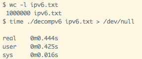

# decompv6
It is a tool for decompressing IPv6 addresses.
It operates at ultra high speed!!
If you use the inet_pton function like sample.c, you can run decompv6 in just 0.46 seconds even in an environment that takes 3 seconds to decompress 1000000 IPv6 addresses.

## DEMO


## Install
```sh
gcc -Ofast -o decompv6 decompv6.c
```

## USAGE
```sh
./decomp ipv6_file
```

